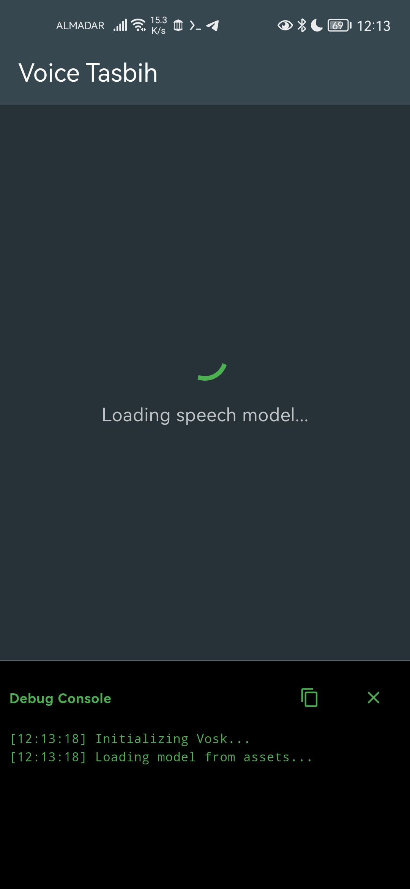
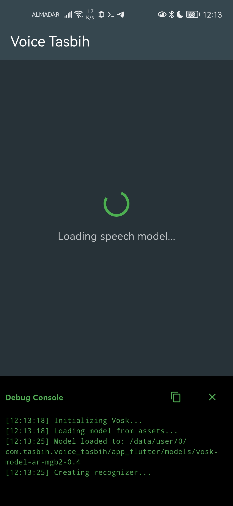
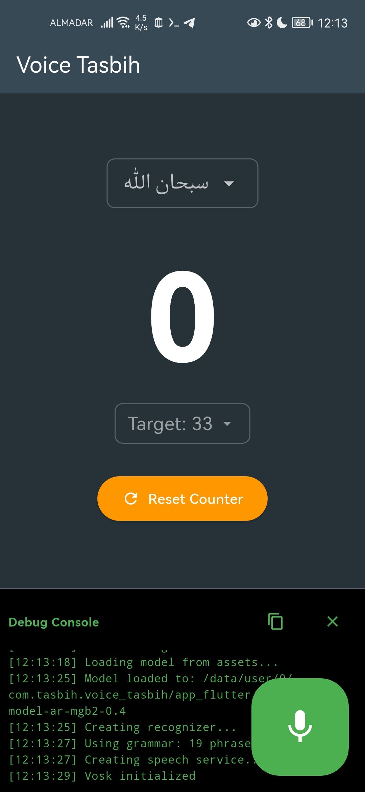
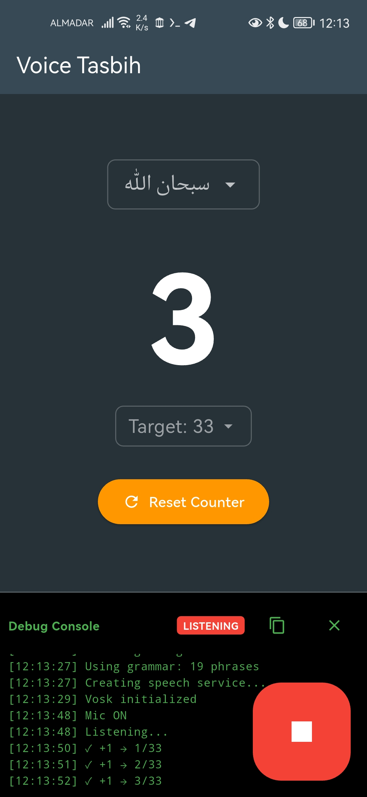

# Voice Tasbih

A Flutter app for counting Dhikr (Islamic remembrances) using offline Arabic voice recognition.

<p align="center">
  
  
  
  
</p>

## Features

- **Dhikr Selection**: سبحان الله, الحمد لله, الله أكبر, لا إله إلا الله
- **Target Selection**: 33, 100, 1000
- **Offline Recognition**: Works 100% offline using Vosk Arabic model
- **Real-time Feedback**: Haptic feedback on each count
- **Debug Console**: On-screen logs for troubleshooting

## Download

Download the latest APK from [GitHub Releases](https://github.com/hazembook/voice-tasbih/releases) or [GitLab Releases](https://gitlab.com/hazembook/voice-tasbih/-/releases).

| Architecture | Device Type |
|--------------|-------------|
| `arm64-v8a` | Most modern phones (recommended) |
| `armeabi-v7a` | Older 32-bit phones |

## Build from Source

### 1. Clone the Repository
```bash
git clone https://github.com/hazembook/voice-tasbih.git
# or
git clone https://gitlab.com/hazembook/voice-tasbih.git

cd voice-tasbih
```

### 2. Download Speech Recognition Model

The app requires the Vosk Arabic model (~333MB) for offline speech recognition.

**Download from one of these sources:**
- **Alphacephei (Official)**: https://alphacephei.com/vosk/models
- **Hugging Face**: https://huggingface.co/vosk-models/vosk-model-ar-mgb2

**Download the file and place it here:**
```
assets/models/vosk-model-ar-mgb2-0.4.zip
```

**Quick download (Linux/macOS):**
```bash
# Create directory if needed
mkdir -p assets/models

# Download model (~333MB)
curl -L -o assets/models/vosk-model-ar-mgb2-0.4.zip \
  https://alphacephei.com/vosk/models/vosk-model-ar-mgb2-0.4.zip
```

### 3. Install Dependencies
```bash
flutter pub get
```

### 4. Build
```bash
# Debug APK
flutter build apk --debug

# Release APK (split by architecture for smaller size)
flutter build apk --release --split-per-abi
```

## Model Details

| Model | Size | License |
|-------|------|---------|
| vosk-model-ar-mgb2 | ~333MB | Apache 2.0 |

The model is based on the MGB2 Arabic speech corpus and supports Modern Standard Arabic.

## Project Structure

```
lib/
├── core/services/
│   └── vosk_speech_service.dart    # Offline ASR implementation
├── features/counter/
│   ├── application/                 # State management
│   ├── domain/models/               # Data models
│   └── presentation/                # UI
└── main.dart

assets/models/
└── vosk-model-ar-mgb2-0.4.zip      # Download separately (not in git)
```

## Requirements

- Flutter 3.0+
- Android SDK (for Android builds)
- ~400MB storage (app + model)

## Known Issues

- **La ilaha illallah** (لا إله إلا الله) occasionally misrecognized due to phonetic complexity
- **APK size** is large (~335MB) due to embedded Vosk Arabic model
- **Noise sensitivity**: Background noise or nearby voices may cause recognition confusion, requiring mic restart to continue

## License

This project is licensed under the **Waqf General Public License 2.0** ([English](LICENSE) | [Arabic](LICENSE.ar)).

The Vosk Arabic model is licensed under Apache 2.0 - see https://alphacephei.com/vosk/models for details.
